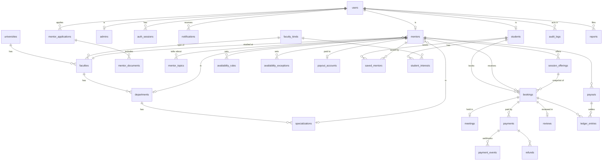

| `departments` | `id`, `faculty_id`, `slug`, `name_ar`, `source_url?`, `is_active` | unique (`faculty_id`, `slug`). Researched rows use `w-<hash of name>`, admin-added ones `d-…`. || `faculties` | `id`, `university_id`, `kind_id`, `name_ar`, `city?`, `accreditation_status` (`accredited` | `conditional` | `not_accredited` | `unknown`), `accredited_at?`, `accreditation_expires_at?`, `accredited_programs` (jsonb), `source_url?`, `verified_at?`, `is_active` | **unique (`university_id`, `name_ar`)** — Al-Azhar has several faculties of one kind (city, boys / girls). Check: expiry ≥ accreditation date. || `universities` | `id`, `slug` (unique), `name_ar`, `name_en?`, `type` (`public` | `private` | `national` | `azhar` | `technological` | `international`), `governorate?`, `website?`, `source_url?`, `is_active`, `sort_order` | Renamed universities keep their id (Helwan → `capital`). |# SABEQ — Database design (Phase 06)

> Status: **implemented** (Phase 06) — schema `apps/api/prisma/schema.prisma`, migrations `apps/api/prisma/migrations`.
> PostgreSQL (ADR-0007) via Prisma. Local: Docker. Staging/production: Neon (Frankfurt).

## Principles

- **IDs**: UUID v7 (time-ordered → index-friendly at scale), generated by Prisma.
- **Time**: every timestamp is `timestamptz` in UTC; shown in `Africa/Cairo`.
- **Money**: integer piasters + `currency` (ADR-0010). Commission stored per booking (`commission_bps`) so a future change never rewrites history.
- **Names**: tables `snake_case` plural, columns `snake_case` (Prisma `@@map`/`@map`).
- **Soft delete** only where the law/business needs history (users); everything financial is append-only.
- **Snapshots**: a booking copies the price, duration and session type at booking time — later edits by the mentor never change past bookings.
- **Guarantees in the database, not only in code**: unique constraints, check constraints, and an exclusion constraint that makes double booking impossible.

## Entity map

## Tables

### Identity & access (Phases 07–08)

| Table           | Key columns                                                                                                                                                                                                                                                                                | Rules                                                                                   |
| --------------- | ------------------------------------------------------------------------------------------------------------------------------------------------------------------------------------------------------------------------------------------------------------------------------------------ | --------------------------------------------------------------------------------------- |
| `users`         | `id`, `phone` (E.164, **unique**), `role` (`student` \| `mentor` \| `admin`), `status` (`active` \| `suspended` \| `deleted`), `full_name?` (filled after first login), `email?` (unique), `email_verified_at?`, `avatar_key?`, `last_login_at`, `created_at`, `updated_at`, `deleted_at?` | One role per account (ADR-0008). Phone is the login (ADR-0005).                         |
| `students`      | `user_id` (PK/FK), `track` (`science_math` \| `science_bio` \| `literary` \| `azhar` \| `other`), `school_year`, `governorate?`                                                                                                                                                            | Profile only; no grades stored unless the student types them.                           |
| `admins`        | `user_id` (PK/FK), `admin_role` (`super_admin` \| `verifier` \| `support` \| `finance`), `totp_secret_enc?`, `totp_enabled_at?`                                                                                                                                                            | Second factor mandatory for admins. Secret encrypted at rest.                           |
| `auth_sessions` | `id`, `user_id`, `app` (`web` \| `admin`), `token_hash` (SHA-256, unique), `user_agent`, `ip`, `created_at`, `last_used_at`, `expires_at`, `revoked_at?`                                                                                                                                   | Session tokens stored hashed only (ADR-0015). OTP codes live in Redis, never in the DB. |

### Education catalog (Phase 11)

The design browses **kinds of faculty** ("الهندسة") across universities, and a mentor studied at a **specific faculty of a specific university** ("هندسة القاهرة").

| Table              | Key columns                                                                                                                                                                                                                            | Rules                                                      |
| ------------------ | -------------------------------------------------------------------------------------------------------------------------------------------------------------------------------------------------------------------------------------- | ---------------------------------------------------------- |
| `universities`     | `id`, `slug` (unique), `name_ar`, `name_en?`, `type` (`public` \| `private` \| `national` \| `azhar`), `governorate`, `is_active`, `sort_order`                                                                                        |                                                            |
| `faculty_kinds`    | `id`, `slug` (`eng`, `med` …, unique), `name_ar` ("الهندسة"), `full_name_ar` ("كلية الهندسة"), `icon`, `category` (`medical` \| `engineering` \| `science` \| `literary` \| `arts`), `study_years`, `summary`, `about`, `generic_info` | Powers explore, faculty pages, filters. Curated by admins. |
| `faculties`        | `id`, `university_id`, `kind_id`, `name_ar?` (override), `is_active`                                                                                                                                                                   | **unique (`university_id`, `kind_id`)**.                   |
| `departments`      | `id`, `faculty_id`, `slug`, `name_ar`, `is_active`                                                                                                                                                                                     | unique (`faculty_id`, `slug`).                             |
| `faculty_cutoffs`  | `id`, `faculty_id`, `year`, `track` (`science_bio`                                                                                                                                                                                     | `science_math`                                             | `literary`), `phase`, `min_score`, `max_score`, `source_url` | unique (`faculty_id`, `year`, `track`, `phase`); checks `min_score ≤ max_score`, year 2000–2100. |
| `specializations`  | `id`, `department_id`, `slug`, `name_ar`                                                                                                                                                                                               | unique (`department_id`, `slug`).                          |
| `faculty_insights` | `id`, `kind_id`, `quote`, `mentor_id?`, `sort_order`, `is_published`                                                                                                                                                                   | The «اللي الخريجين بيقولوه» quotes on faculty pages.       |

#### Where the catalog data comes from

`prisma/catalog/*` holds the researched data; `seedCatalog` loads it idempotently on every environment, and
`pnpm exec tsx prisma/catalog/check.ts` checks it for consistency. Every row keeps its source URL. Checked 2026-10-09.

| Data                                    | Source                                                                                                    |
| --------------------------------------- | --------------------------------------------------------------------------------------------------------- |
| 121 universities (all recognised types) | Ministry of Higher Education list, as republished 2026-07-19 / 2026-08-14                                 |
| Public universities' faculties (458)    | Each university's Wikipedia article, cross-checked with NAQAAE and the Tansik 2026 announcement           |
| Al-Azhar faculties (90)                 | Coordination Office directory of Al-Azhar faculties                                                       |
| Private / ahliya / international        | NAQAAE decisions only (official evidence the faculty exists) — incomplete by design                       |
| Accreditation                           | NAQAAE decisions table, snapshot `naqaae-2026-10-09.json` (latest decision in it: 2026-05-20)             |
| Cutoffs (173)                           | Minister's Tansik 2026 phase-1 announcement (2026-08-10)                                                  |
| Departments (1,142 in 112 faculties)    | Each faculty's Arabic Wikipedia article; faculties without one show "still collecting" instead of a guess |

Nothing in the catalog is invented: the prototype's generic departments and "graduate" quotes are hidden by the seed.
Faculties not confirmed by research are hidden, never deleted (mentors may reference them).

### Mentors (Phases 09, 12, 14)

| Table                     | Key columns                                                                                                                                                                                                                                                                                               | Rules                                                                                                                                                                                        |
| ------------------------- | --------------------------------------------------------------------------------------------------------------------------------------------------------------------------------------------------------------------------------------------------------------------------------------------------------- | -------------------------------------------------------------------------------------------------------------------------------------------------------------------------------------------- |
| `mentors`                 | `user_id` (PK/FK), `slug` (unique), `kind` (`graduate` \| `teaching_assistant` \| `professor`), `faculty_id`, `department_id?`, `specialization_id?`, `major_label`, `graduation_year?`, `bio`, `city`, `is_listed`, `listed_at?`, `rating_avg`, `rating_count`, `sessions_completed`, `accepts_bookings` | **Visible to students only when `is_listed`**, which is set only by an approved application. Counters are denormalised for fast cards and updated in the same transaction as the source row. |
| `mentor_topics`           | `mentor_id`, `label`, `sort_order`                                                                                                                                                                                                                                                                        | «بيتكلم عن» chips.                                                                                                                                                                           |
| `mentor_applications`     | `id`, `user_id` (applicant; the mentor profile is created on approval), `status` (`draft` → `submitted` → `under_review` → `changes_requested` \| `approved` \| `rejected`), `payload` (jsonb — the form as submitted), `submitted_at?`, `reviewer_id?`, `decided_at?`, `decision_note?`                  | Every status change is written to `audit_logs`. One open application per person (partial unique index).                                                                                      |
| `mentor_documents`        | `id`, `application_id`, `kind` (`graduation_certificate` \| `enrollment_proof` \| `national_id_front`), `storage_key`, `mime_type`, `size_bytes`, `sha256`, `uploaded_at`, `purge_after?`                                                                                                                 | Files live in the **private bucket**; the row keeps only the key. National ID images are purged after verification (retention policy, Phase 21).                                             |
| `session_offerings`       | `id`, `mentor_id`, `kind` (`consultation` \| `comparison` \| `quick_call`), `duration_min`, `medium` (`video` \| `audio`), `price_piasters`, `is_active`                                                                                                                                                  | The three session types of the booking flow; price 100–500 EGP enforced by a check constraint.                                                                                               |
| `availability_rules`      | `id`, `mentor_id`, `weekday` (0–6), `start_minute`, `end_minute`                                                                                                                                                                                                                                          | Weekly pattern in Cairo time; check `start < end`.                                                                                                                                           |
| `availability_exceptions` | `id`, `mentor_id`, `date`, `start_minute?`, `end_minute?`, `kind` (`blocked` \| `extra`)                                                                                                                                                                                                                  | Holidays, one-off extra slots.                                                                                                                                                               |
| `payout_accounts`         | `mentor_id` (PK/FK), `method` (`bank_transfer` \| `instapay` \| `vodafone_cash`), `details_enc`, `verified_at?`                                                                                                                                                                                           | Account numbers encrypted at rest (ADR-0009).                                                                                                                                                |

### Students' saved data (Phase 08)

| Table               | Key columns                                  | Rules                                 |
| ------------------- | -------------------------------------------- | ------------------------------------- |
| `saved_mentors`     | (`student_id`, `mentor_id`) PK, `created_at` |                                       |
| `student_interests` | (`student_id`, `kind_id`) PK                 | Faculties the student is considering. |

### Bookings, sessions, payments (Phases 14–17)

| Table            | Key columns                                                                                                                                                                                                                                                                                                                                                                                               | Rules                                                                                                                                                                                                                    |
| ---------------- | --------------------------------------------------------------------------------------------------------------------------------------------------------------------------------------------------------------------------------------------------------------------------------------------------------------------------------------------------------------------------------------------------------- | ------------------------------------------------------------------------------------------------------------------------------------------------------------------------------------------------------------------------ |
| `bookings`       | `id`, `student_id`, `mentor_id`, `offering_id`, snapshot: `kind`, `duration_min`, `medium`, `price_piasters`, `fee_piasters`, `total_piasters`, `commission_bps`, `currency`; `starts_at`, `ends_at`, `status` (`pending` \| `confirmed` \| `cancelled` \| `completed` \| `no_show` \| `refunded`), `hold_expires_at?`, `student_note?`, `cancelled_at?`, `cancelled_by?`, `cancel_reason?`, `created_at` | **Exclusion constraint**: no two `pending`/`confirmed` bookings of the same mentor may overlap in time (`btree_gist`, `tstzrange(starts_at, ends_at)`). A slot can never be sold twice — even under concurrent requests. |
| `meetings`       | `booking_id` (PK/FK), `provider`, `room_id`, `starts_at`, `ended_at?`, `student_joined_at?`, `mentor_joined_at?`                                                                                                                                                                                                                                                                                          | In-site video (Phase 17); attendance decides `completed` vs `no_show`.                                                                                                                                                   |
| `payments`       | `id`, `booking_id`, `provider` (`paymob`), `method` (`card` \| `wallet` \| `kiosk`), `amount_piasters`, `currency`, `status` (`pending` \| `succeeded` \| `failed` \| `refunded` \| `partially_refunded`), `provider_order_id`, `provider_txn_id?` (**unique**), `kiosk_reference?`, `failure_reason?`, `created_at`, `succeeded_at?`                                                                     | Status changes **only** from verified webhooks (ADR-0006).                                                                                                                                                               |
| `payment_events` | `id`, `payment_id?`, `provider_event_id` (**unique** — idempotency), `type`, `payload` (jsonb), `hmac_valid`, `received_at`, `processed_at?`                                                                                                                                                                                                                                                              | Every webhook is stored before it is processed; replays are ignored.                                                                                                                                                     |
| `refunds`        | `id`, `payment_id`, `amount_piasters`, `status`, `reason`, `provider_refund_id?`, `requested_by`, `created_at`                                                                                                                                                                                                                                                                                            |                                                                                                                                                                                                                          |
| `ledger_entries` | `id`, `booking_id?`, `payout_id?`, `mentor_id`, `type` (`mentor_earning` \| `platform_fee` \| `refund_reversal` \| `payout`), `amount_piasters` (signed), `created_at`                                                                                                                                                                                                                                    | **Append-only.** A mentor's balance = sum of their entries. Never updated or deleted.                                                                                                                                    |
| `payouts`        | `id`, `mentor_id`, `amount_piasters`, `method`, `status` (`pending` \| `processing` \| `paid` \| `failed`), `reference?`, `processed_by?`, `period_start`, `period_end`, `created_at`, `paid_at?`                                                                                                                                                                                                         | Executed by a `finance` admin.                                                                                                                                                                                           |

### Reviews, notifications, trust (Phases 18–21)

| Table                     | Key columns                                                                                                                                                                                        | Rules                                                         |
| ------------------------- | -------------------------------------------------------------------------------------------------------------------------------------------------------------------------------------------------- | ------------------------------------------------------------- |
| `reviews`                 | `id`, `booking_id` (**unique** — one review per session), `student_id`, `mentor_id`, `rating` (1–5 check), `text?`, `status` (`published` \| `hidden` \| `flagged`), `moderated_by?`, `created_at` | Allowed only for `completed` bookings (service + trigger).    |
| `notifications`           | `id`, `user_id`, `type`, `title`, `body`, `data` (jsonb), `read_at?`, `created_at`                                                                                                                 | In-app inbox.                                                 |
| `notification_deliveries` | `id`, `notification_id`, `channel` (`email` \| `sms` \| `in_app`), `status`, `provider_message_id?`, `attempts`, `last_error?`, `sent_at?`                                                         | Retries and provider tracking (Phase 19).                     |
| `reports`                 | `id`, `reporter_id`, `target_type` (`mentor` \| `review` \| `booking`), `target_id`, `reason`, `status` (`open` \| `resolved` \| `dismissed`), `handled_by?`, `created_at`                         |                                                               |
| `audit_logs`              | `id`, `actor_user_id?`, `actor_role`, `action`, `entity_type`, `entity_id`, `before` (jsonb), `after` (jsonb), `ip?`, `request_id?`, `created_at`                                                  | **Append-only.** Every admin action and every money movement. |
| `newsletter_subscribers`  | `email` (PK), `source`, `created_at`, `unsubscribed_at?`                                                                                                                                           | Footer «مواعيد التنسيق».                                      |

## Key indexes (scale)

| Query                                                            | Index                                                                                                          |
| ---------------------------------------------------------------- | -------------------------------------------------------------------------------------------------------------- |
| Discovery: listed mentors of a faculty, sorted by rating / price | `mentors (faculty_id, is_listed, rating_avg DESC)`, `session_offerings (mentor_id, is_active, price_piasters)` |
| Text search on names, majors, universities (Phase 13)            | `pg_trgm` GIN indexes; dedicated search engine only if needed                                                  |
| Mentor calendar                                                  | `bookings (mentor_id, starts_at)` + the exclusion constraint                                                   |
| "My sessions"                                                    | `bookings (student_id, starts_at DESC)`                                                                        |
| Webhook lookup                                                   | unique `payments.provider_txn_id`, unique `payment_events.provider_event_id`                                   |
| Inbox                                                            | `notifications (user_id, read_at, created_at DESC)`                                                            |
| Mentor balance                                                   | `ledger_entries (mentor_id, created_at)`                                                                       |

Growth path: `audit_logs`, `notifications` and `payment_events` are the fast-growing tables — partition by month when they pass tens of millions of rows; read replicas for discovery queries.

## Decisions (product owner, 2026-10-07)

1. **Mentor kinds** — graduates, teaching assistants (معيد) and professors (دكتور). Current students are **not** mentors at launch (`MentorKind`; documents: graduation certificate or employment proof + national ID).
2. **Session prices** — one base price set by the mentor (100–500 EGP); comparison = ×1.3 and quick call = ×0.5, rounded to 10 EGP. The booking stores the final snapshot.
3. **Late cancellation** (< 24 h before the session) — 50 % refund (`bookings.refund_share_bps = 5000`); earlier — full refund.
4. **Student data** — track and school year only; scores are never stored.
5. **National ID images** — kept, **encrypted** in the private bucket (`mentor_documents.encryption_key_id`); access is audited (Phase 21).

## Working with the database

| Task                                                            | Command (from the repo root)                                    |
| --------------------------------------------------------------- | --------------------------------------------------------------- |
| Apply migrations (dev, creates new ones from schema changes)    | `pnpm --filter @sabeq/api db:migrate`                           |
| Apply migrations (staging/production — release step)            | `pnpm --filter @sabeq/api db:deploy` / Docker target `migrator` |
| Seed catalog (+ demo mentors when `APP_ENV=local`)              | `pnpm --filter @sabeq/api db:seed`                              |
| Browse data                                                     | `pnpm --filter @sabeq/api db:studio`                            |
| Integration tests (real PostgreSQL, separate `*_test` database) | `pnpm --filter @sabeq/api test:db`                              |

In Docker, the one-shot `migrate` service applies migrations before `api` starts.

- `DATABASE_URL` — runtime connection (Neon: the **-pooler** host). `DATABASE_DIRECT_URL` — migrations only (Neon: direct host).
- Constraints Prisma cannot express (exclusion, CHECK, append-only triggers) are hand-written at the end of the `init` migration. Prisma reports no drift with them in place.
- Schema change workflow: edit `schema.prisma` → `db:migrate` (review the generated SQL) → commit schema + migration together.
